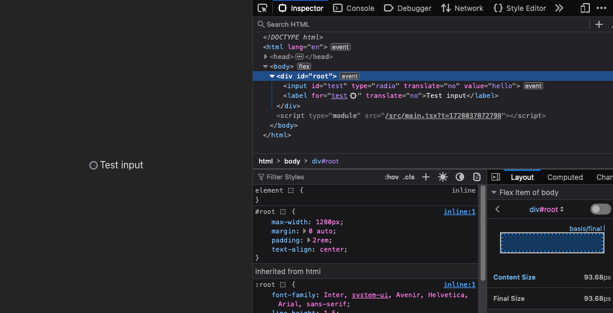
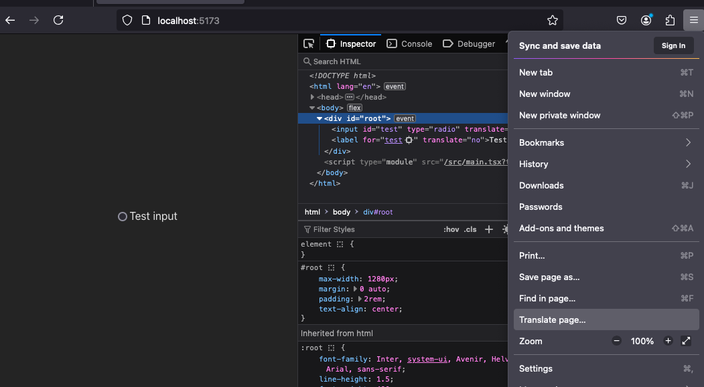
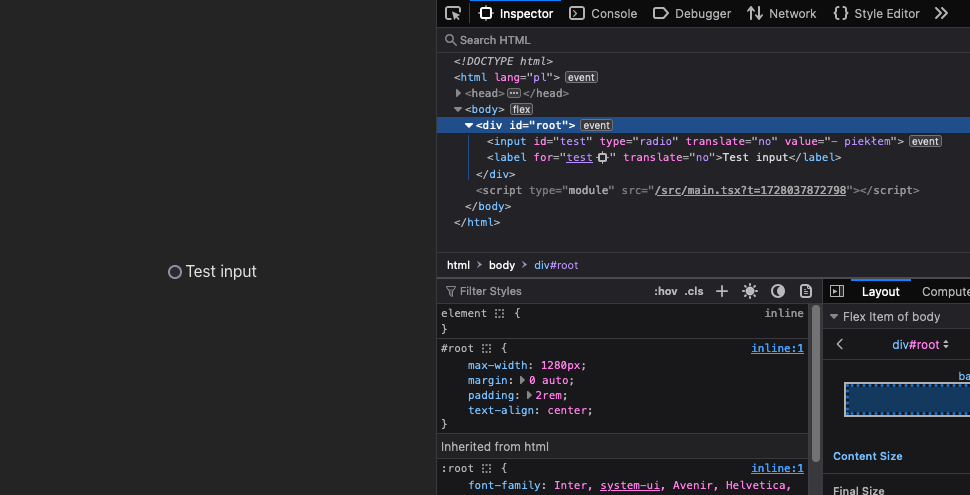

# Running the app

The app can be started using:

`npm run dev`

It is accessible via `localhost:5173`

# The issue

After loading the app and accessing it via Firefox, inspect the radio input element via dev tools.

Then attempt to translate the page using Firefox's built-in translator.

You will notice that this translator has translated the "value" attribute of the input element.

You will also notice that `translate="no"` has no effect on this, and that it is working as intended for the label element.

